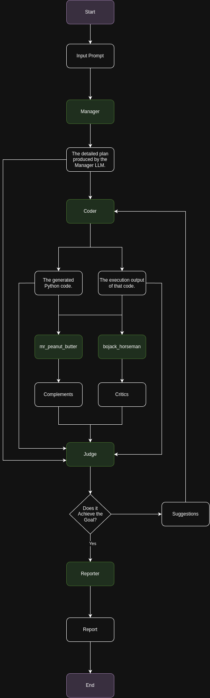

# LLM-Powered Code Review Pipeline

This repository contains a Python script that orchestrates an LLM-based review pipeline. The pipeline leverages multiple LLMs to collaboratively generate, review, and refine Python code. It is designed to iteratively produce a working script that meets a detailed Manager's outline while ensuring that critical errors (e.g., syntax errors) are flagged and corrected.

## Overview

The pipeline comprises the following LLM nodes:

- **Manager LLM**:
  - **Input**: User request (example: make a + skewed distribution curve)
  - **Output**: A detailed plan/outline that describes the tasks required to generate and visualize a positively skewed distribution.

- **Coder LLM**:
  - **Input**: Manager's outline and optional extra instructions (if any) from the Judge
  - **Output**: Python code (which is saved and executed)
  - **Additional**: The coder is explicitly instructed to generate plain Python code without markdown formatting and to ensure that it compiles without syntax errors. A syntax check is performed using `py_compile`.

- **Feedback Branch**:
  - **Bojack_Horseman (Critical LLM)**:
    - **Input**: The generated Python code and its execution output
    - **Output**: A purely critical evaluation, prioritizing any syntax or compilation errors along with design flaws and logical issues.

  - **Mr_Peanut_Butter (Positive LLM)**:
    - **Input**: The same Python code and its execution output
    - **Output**: A purely positive evaluation highlighting effective design and robust implementation.

  Both feedback outputs are gathered asynchronously.

- **Judge LLM**:
  - **Input**: The Manager's outline, the Coder's code and execution output, and both sets of feedback (from Bojack_Horseman and Mr_Peanut_Butter), along with the full conversation history.
  - **Output**: A decision on whether the code meets the Manager's outline. If critical issues (e.g., syntax errors) are found, the Judge instructs the coder to fix them; otherwise, it declares the goal achieved.

- **Reporter LLM**:
  - **Input**: The entire conversation log that records key exchanges between the nodes.
  - **Output**: A detailed, illustrated report summarizing the conversation with bullet-point entries (e.g., “Manager to Coder: …”, “Judge to Coder (Iteration 1): …”) which is saved as a `report.txt` file.

## How It Works

1. **User Request**:
   The pipeline begins when the user submits a request (e.g., "make a + skewed distribution curve").

2. **Manager LLM**:
   Processes the request and returns a detailed outline of tasks.

3. **Coder LLM**:
   Receives the outline (and any extra instructions from previous Judge feedback) and generates Python code.
   - **Syntax Check**: The code is saved to a file and compiled using `py_compile` to catch any syntax errors. If errors are found, they are added to the execution output.
   - The code is then executed, and both the code and execution output are passed on.

4. **Feedback Branch**:
   The code and execution output are fed concurrently to:
   - **Bojack_Horseman** (critical feedback) and
   - **Mr_Peanut_Butter** (positive feedback).

5. **Judge LLM**:
   Receives the following context:
   - Manager's outline
   - Coder's generated code and execution output
   - Feedback from Bojack_Horseman and Mr_Peanut_Butter
   - The entire conversation history from previous iterations
   The Judge determines if the code meets the Manager’s outline and instructs the coder to make changes if necessary.

6. **Iteration Loop**:
   The cycle (Coder → Feedback → Judge) repeats for a maximum of three iterations.
   - If the Judge deems the code acceptable, the process ends.

7. **Reporter LLM**:
   Finally, the entire conversation is summarized in a detailed report that is saved to `report.txt`.

## Visual Diagram



### Context Summary:
- **Manager LLM**:
  - Receives the **User Request**.

- **Coder LLM**:
  - Receives the **Manager Outline** and any extra instructions from the Judge.

- **Bojack_Horseman and Mr_Peanut_Butter**:
  - Both receive the **Python Code and Execution Output**.

- **Judge LLM**:
  - Receives the **Manager Outline**, **Coder's Code & Execution Output**, **Feedback** from Bojack_Horseman and Mr_Peanut_Butter, plus the **Conversation History**.

- **Reporter LLM**:
  - Receives the full **Conversation Log** from all iterations and summarizes the exchanges.

## Setup and Usage

1. **Installation**:
   - Ensure you have Python 3 installed.
   - Install the required packages using pip:
     ```bash
     pip install openai python-dotenv asyncio
     ```
   - Set up your `.env` file with your OpenAI API key:
     ```
     OPENAI_API_KEY=your_openai_api_key_here
     ```

2. **Execution**:
   Run the pipeline with:
   ```bash
   python your_script.py
   ```
   Follow the prompt to enter your request.

3. **Output**:
   - The generated code, feedback files, and final report (`report.txt`) are saved in the `./output` directory.

## Conclusion

This pipeline leverages a collaborative LLM-based approach to generate and refine Python code, ensuring that critical errors are caught and addressed. The detailed reporting mechanism provides clear insights into the iterative discussions and decisions made by each LLM, making it a robust tool for automated code generation and review.
